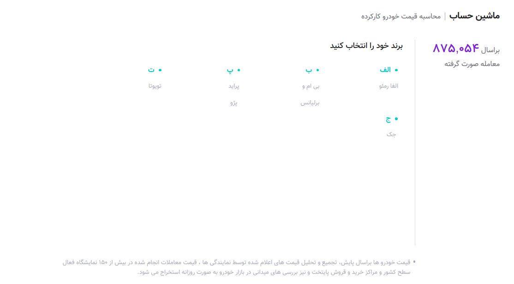

<div style="text-align: center;">
  <br />
  <br />
  <h1>Car Price Calculation</h1>
  <div style="text-align: center">
    <h3><a href="https://bama-coding-challenge.netlify.app/"  target="_blank">Demo</a></h3>
  </div>
  <div style="text-align: center">
    <h2>Bama Coding Challenge (Frontend - Nuxt.js)</h2>
  </div>
  
  <p>This project is a evaluation project for <a href="https://bama.ir/">Bama.ir</a> company </p>
</div>

<br>
<br>



<br>
<br>

## Project Overview

The **Car Price Calculation** project built with [Nuxt 3](https://nuxt.com/). According to the rules of the project, some dependencies should not be used, for state management i used Nuxt built in useState composable.

## 🚀 Setup

In your terminal, install all node dependencies:

```bash
cd bama-coding-challenge
npm install
```

<br>

## Development Server

Build the application for development environment:

```bash
npm run dev
```

## Production

Build the application for production:

```bash
npm run build
```

Locally preview production build:

```bash
npm run preview
```
